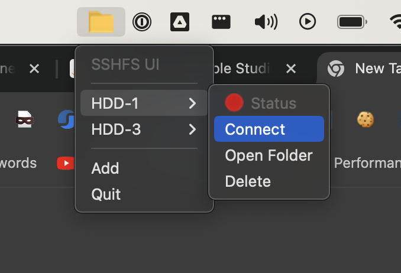
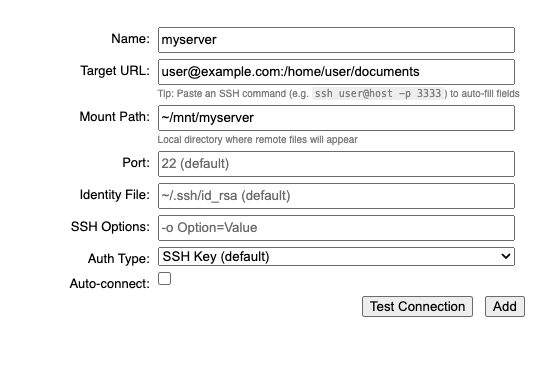

# sshfsui

A tray-based application for mounting remote filesystems locally using SSHFS. Works on macOS and Linux.



## What It Does

sshfsui lets you mount remote filesystems to local directories so you can interact with remote files as if they were stored on your computer. All file changes are synchronized transparently in both directions using SSHFS under the hood.

You manage connections through the system tray menu. Each connection (called a "target") has:

- A **name** (used as an identifier — must be file-safe, no spaces or special characters)
- A **target URL** (SSH host and path, e.g. `user@host:/remote/path`)
- A **mount path** (local directory where remote files will appear, e.g. `~/mnt/myserver`)
- An **auth type** (SSH Key or Password)



Once configured, connect or disconnect to any target from the tray menu with a single click.

## Quick Start

**For end users** (just want to use the app):
1. Run `bin/install-deps.sh` to install prerequisites
2. Run `bin/run` to launch the app
3. Click the tray icon → "Add" to configure your first remote target

**For developers** (building from source):
1. Run `bin/install-deps.sh` to install prerequisites
2. Run `bin/build-local.sh` to build the app
3. Install: `unzip out/make/zip/darwin/x64/sshfsui-darwin-x64-*.zip && mv sshfsui.app /Applications/`
4. Update/rebuild: Quit app, `rm -rf /Applications/sshfsui.app`, rebuild, reinstall

## Prerequisites

You need the following tools installed before running sshfsui:

| Tool       | macOS                                                                          | Linux                                                        |
| ---------- | ------------------------------------------------------------------------------ | ------------------------------------------------------------ |
| `ssh`      | [OpenSSH](https://formulae.brew.sh/formula/openssh) via Homebrew               | `apt install openssh-client`                                 |
| `sshfs`    | [macFUSE](https://osxfuse.github.io/) + sshfs via Homebrew                     | `apt install sshfs`                                          |
| `timeout`  | [coreutils](https://formulae.brew.sh/formula/coreutils) via Homebrew           | Already included                                             |
| `sshpass`  | `brew install esolitos/ipa/sshpass` (only needed for password auth)            | `apt install sshpass` (only needed for password auth)        |

### Automated Installation (Recommended)

Run the included script to install all prerequisites automatically:

```bash
bin/install-deps.sh
```

This script:

- Detects your operating system (macOS or Linux)
- Installs Homebrew on macOS if not already present
- Installs all required tools, skipping any already installed
- Prints a summary of what was installed

## Installation

### Option 1: Download a Release

Download the latest installer for your OS from [GitHub Releases](https://github.com/thekashifmalik/sshfsui/releases/latest).

### Option 2: Build from Source

If you want to build the app yourself (e.g. on Apple Silicon), see [Building from Source](#building-from-source) below.

## Getting Started

1. **Install prerequisites** (see above).

2. **Launch the app**:

   ```bash
   bin/run
   ```

   A tray icon will appear in your menu bar.

3. **Add a target**: Click the tray icon and select "Add". Fill in:
   - **Name**: A short label (e.g. `myserver`) — no spaces or special characters.
   - **Target URL**: Your SSH connection string (e.g. `user@192.168.1.100:/home/user`).
   - **Mount Path**: A local directory to mount to (e.g. `~/mnt/myserver`). Created automatically if it doesn't exist.
   - **Auth Type**: Choose "SSH Key" or "Password".
     - **SSH Key**: Your SSH keys must already be set up on the remote host (see [Setting Up SSH Keys](#ssh-key-recommended)).
     - **Password**: Enter your SSH password. It is encrypted and stored securely on your machine (never saved as plain text).

4. **Connect**: Click the tray icon, find your target, and click "Connect". The remote filesystem will appear at your mount path.

5. **Disconnect**: Click the tray icon, find your target, and click "Disconnect".

6. **Open Folder**: Click "Open Folder" in the target submenu to open the mounted directory in Finder/file manager.

## Authentication

### SSH Key (Recommended)

SSH key authentication is the default and recommended method. To use it:

1. Generate an SSH key pair if you don't have one:

   ```bash
   ssh-keygen -t ed25519
   ```

   Press Enter to accept the default file location. You can optionally set a passphrase.

2. Copy your public key to the remote host:

   ```bash
   ssh-copy-id user@your-remote-host
   ```

3. Verify you can connect without a password:

   ```bash
   ssh user@your-remote-host
   ```

4. In sshfsui, select "SSH Key" as the auth type when adding a target.

### Password

If you cannot set up SSH keys, you can use password authentication:

1. Make sure `sshpass` is installed (the install script handles this, or install manually — see Prerequisites).
2. In sshfsui, select "Password" as the auth type when adding a target.
3. Enter your SSH password in the password field.

Your password is encrypted using your operating system's secure credential storage (macOS Keychain via Electron's safeStorage API) and is never stored as plain text. The encrypted credential is saved in `~/.sshfsui/<target-name>/credential` with owner-only permissions (mode 0600).

## Troubleshooting

### "Cannot be opened because the developer cannot be verified" (macOS)

This happens with unsigned builds. To open unsigned apps:

1. Right-click (or Control-click) on `sshfsui.app` in `/Applications/`
2. Select "Open" from the context menu
3. Click "Open" in the security dialog

After the first launch, you can open the app normally. Alternatively, you can remove the quarantine attribute:

```bash
xattr -d com.apple.quarantine /Applications/sshfsui.app
```

### "sshfs not found" error on launch

Install sshfs and its FUSE dependency:

- **macOS**: `brew install --cask macfuse && brew install sshfs`
- **Linux**: `apt install sshfs`

On macOS, you may need to allow the macFUSE kernel extension in System Settings > Privacy & Security after installation. A reboot may also be required.

### "timeout not found" error on launch

- **macOS**: `brew install coreutils`
- **Linux**: Already included with coreutils (pre-installed on most distributions)

### Connection fails with "Operation timed out"

- Verify you can reach the host: `ping your-remote-host`
- Verify SSH works manually: `ssh user@your-remote-host`
- Check that the remote path in your target URL exists

### Connection fails with password auth

- Verify `sshpass` is installed: `which sshpass`
- Verify your password is correct by testing manually: `ssh user@your-remote-host`
- Try removing and re-adding the target to reset the stored password

### Mount path permission error

If the mount path requires elevated permissions to create, sshfsui will prompt for your system password (via a system dialog) to create the directory.

## Configuration

Target configurations are stored as flat files in `~/.sshfsui/`. Each target has its own directory:

```text
~/.sshfsui/
  myserver/
    target       # SSH URL (e.g. user@host:/path)
    mount        # Local mount path (e.g. ~/mnt/myserver)
    auth         # Auth type: "key" or "password"
    credential   # Encrypted password (only present for password auth)
```

You generally don't need to edit these files directly — use the tray menu to add, edit, or delete targets.

## Building from Source

### Prerequisites for Building

In addition to the runtime prerequisites, you need:

- [Node.js](https://nodejs.org/) (v18 or later)
- [Yarn](https://yarnpkg.com/) package manager

The `bin/install-deps.sh` script installs these for you.

### Quick Build

Use the included build script:

```bash
bin/build-local.sh
```

This script:

- Installs Node.js dependencies (`yarn install`) if needed
- Detects whether you have an Apple Developer ID certificate for code signing
- Builds the app with appropriate settings:
  - **With certificate + .env credentials**: Builds a signed and notarized `.dmg` installer
  - **With certificate only**: Builds a signed `.dmg` (no notarization)
  - **Without certificate**: Builds an unsigned `.zip` (runs locally but cannot be distributed)
- Outputs the built artifact to `out/make/`

### Code Signing (Optional)

To sign and notarize the app for distribution, create a `.env` file in the project root:

```text
APPLE_ID=your@apple.id
APPLE_ID_PASSWORD=your-app-specific-password
TEAM_ID=your-team-id
```

You also need a "Developer ID Application" certificate installed in your macOS Keychain. See [Apple's documentation](https://developer.apple.com/support/certificates/) for details.

### Installing Your Local Build

After running `bin/build-local.sh`, install the app:

**From ZIP (unsigned builds)**:

```bash
# Extract the app
unzip out/make/zip/darwin/x64/sshfsui-darwin-x64-0.10.0.zip

# Move to Applications folder
mv sshfsui.app /Applications/

# First launch: Right-click the app and select "Open" (macOS will warn about unsigned apps)
# After first launch, you can open it normally from the tray or Applications folder
```

**From DMG (signed builds)**:

```bash
# Open the DMG
open out/make/sshfsui-0.10.0.dmg

# Drag sshfsui.app to Applications folder in the Finder window
```

### Uninstalling / Upgrading

To uninstall or upgrade to a new version:

1. **Quit the app**: Click the tray icon → "Quit"

2. **Remove the app bundle**:

   ```bash
   rm -rf /Applications/sshfsui.app
   ```

3. **(Optional) Remove configuration**:

   Your saved targets are stored in `~/.sshfsui/`. To completely remove all data:

   ```bash
   rm -rf ~/.sshfsui
   ```

   **Warning**: This deletes all your saved targets and encrypted passwords. Only do this if you want a clean slate.

4. **Install the new version**: Follow the installation steps above with your new build.

### Development Workflow

```bash
yarn install          # Install dependencies
yarn start            # Run in development mode
yarn package          # Package the app (no installer)
yarn make             # Build installer (.dmg on macOS, .deb on Linux)
yarn test             # Run tests
```

**Development mode** (`yarn start` or `bin/run`):
- Launches the app without building an installer
- Hot reloads when you make code changes
- Shows Electron DevTools for debugging
- Does not require installation to /Applications

## License

MIT

> **Note**: This software is not yet stable. There may be backwards-incompatible changes before v1. Use at your own risk.
